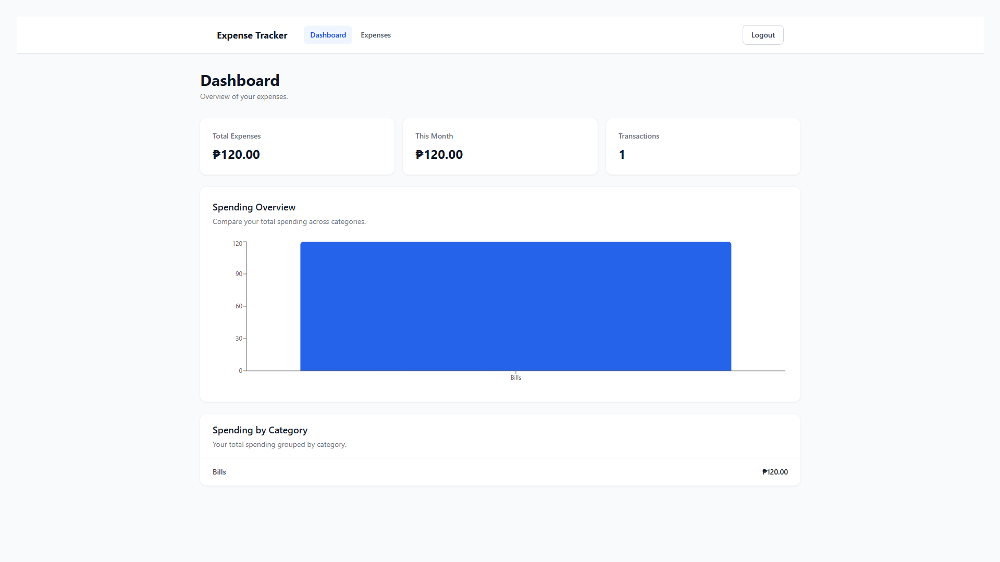
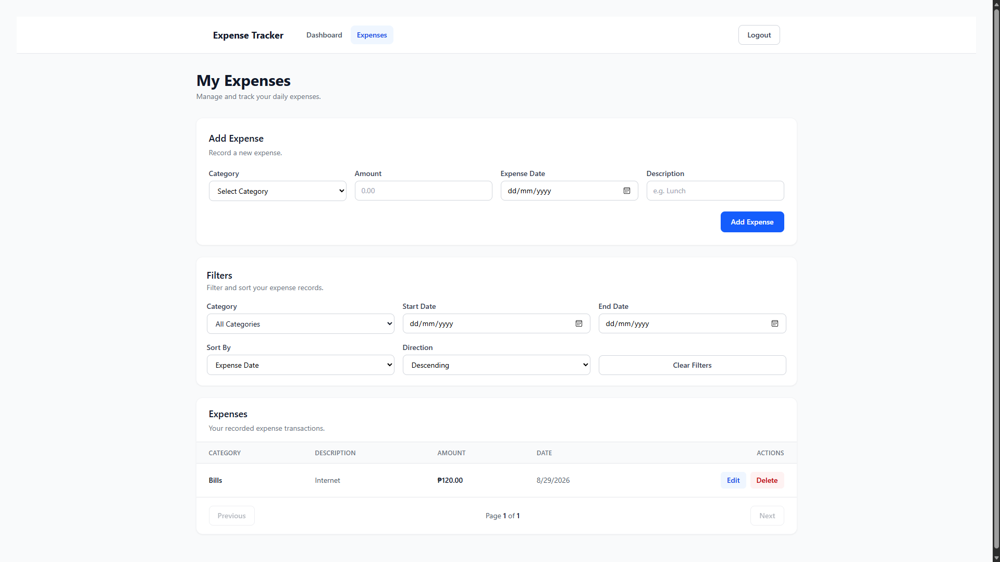
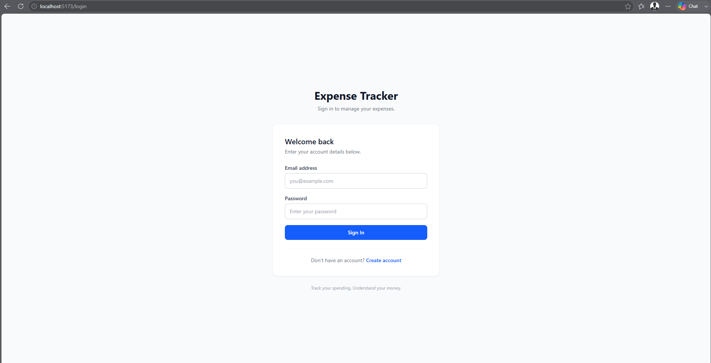

# Expense Tracker

A full-stack expense tracking application built with ASP.NET Core and React.

The application allows users to securely manage their personal expenses, organize spending by category, and view expense summaries through a dashboard.

## Features

### Authentication

- User registration
- User login
- JWT authentication
- Password hashing
- Protected frontend routes
- Logout

### Expense Management

- Create expenses
- View expenses
- Edit expenses
- Delete expenses
- Filter by category
- Filter by date range
- Sort expenses
- Pagination

### Dashboard

- Total expenses
- Current month expenses
- Total transaction count
- Spending breakdown by category
- Category spending chart

## Tech Stack

### Frontend

- React
- TypeScript
- Vite
- Tailwind CSS
- Axios
- React Router
- Recharts

### Backend

- ASP.NET Core Web API
- C#
- Entity Framework Core
- JWT Authentication
- ASP.NET Core Identity PasswordHasher
- Rate Limiting

### Database

- SQL Server

### Testing

- xUnit
- Moq

## Architecture

The backend follows a layered architecture:

```text
ExpenseTracker.Api
        ↓
ExpenseTracker.Application
        ↓
ExpenseTracker.Domain
        ↑
ExpenseTracker.Infrastructure
```

## Screenshots

### Dashboard



### Expenses



### Login

